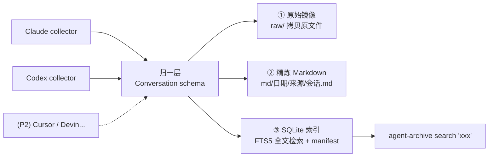

# Agent 对话沉淀层 设计文档

Date: 2026-06-14
Version: v1.1
Status: 待用户评审

> v1.1 变更（基于真实数据自审）：明确 Codex `compacted` 去重坑、正文双轨权威源、加密 reasoning 不可沉淀；原始镜像改 hardlink + 正文大小上限（实测 Codex 3.2GB、Claude 单会话最大 78MB）；定义 native_id 提取与标题 join；Message 增 `kind` 区分 sidechain/thinking；时区归一 UTC；FTS 改独立表。

## 一句话

写一个本地采集器，把分散在各 Agent 工具里的对话**一条不丢地**归一成统一格式，落成「原始镜像 + 精炼 Markdown + SQLite 全文索引」三层档案，每天增量自动跑一次。

先把"存下来、搜得到、翻得动"做扎实；语义检索、喂给 Agent 当记忆、每日摘要、同步飞书/Obsidian 等，全部是以后在这个沉淀层之上叠加，现在一行都不做。

## 目标

- **不丢**：所有能拿到的 Agent 对话，原始数据完整留存，不依赖源 App 是否保留/覆写。
- **能搜**：本地全文检索（关键词），零成本、零网络依赖、瞬时返回。
- **能翻**：人可读的 Markdown 档案，按日期/来源组织，十年后任何工具都打得开。
- **可扩**：新增一个数据源 = 丢一个 collector 进去，核心不返工。
- **自动**：一条命令增量同步，可挂每日定时任务，无需手动导出/粘贴。

## 非目标（刻意砍掉）

- 不做 LLM 处理、分类、摘要、决策/任务抽取（Phase 3+ 北极星，见附录）。
- 不做审核队列、发布工作流、置信度评分。
- 不做飞书/Obsidian/飞书文档的同步（云端目标是后话）。
- 不做向量库、语义检索、Web UI。
- 不把飞书或任何云服务放进数据链路——本设计**纯本地、不同步、不上云**。
- 不做手动导出/粘贴捕获——能自动读的就自动读，读不到的源宁可暂缓也不退化成体力活。

> 设计取舍说明：另一版（Codex）方案把上述全部纳入 v1，并以飞书为统一收集管道。本设计明确反对在 v1 引入这些——它们让"沉淀"这件本可零依赖、自动完成的事，退化成依赖网络、依赖手动操作的多月工程。完整的运营平台蓝图保留在[附录 A](#附录-a北极星完整知识运营平台未来) 作为未来方向，但 v1 不实现。

## 数据源现状（已实测）

| 来源 | 频率 | 本地数据 | 路径 / 方式 | 阶段 |
|------|------|---------|-------------|------|
| Claude Code | 高 | ✅ JSONL | `~/.claude/projects/**/*.jsonl` | **P1** |
| Codex | 高 | ✅ JSONL + 标题索引 | `~/.codex/sessions/**/*.jsonl`、`session_index.jsonl` | **P1** |
| Cursor | 低 | ✅ SQLite（格式脏） | `~/Library/Application Support/Cursor/.../state.vscdb` | P2 |
| Devin | 高 | ❌ 云端（桌面端仅 VSCode 套壳 + LevelDB UI 态） | 官方 API `api.devin.ai`（需 token） | P2 |
| WorkBuddy | 高 | ❌ 云端（本地仅 HTTP 缓存） | 无公开 API，需调研导出/抓流量 | P3 |
| 飞书/Lark | — | ❌ 云端 | API | P3 |
| VS Code / "Tree" | — | ❌ 未发现本地数据 | — | 暂无 |

**关键事实**：你的两大高频源 Claude / Codex 恰好都能纯本地自动读，所以 P1 即可覆盖最高价值且零依赖；Devin/WorkBuddy 虽高频但本质是云端外部依赖，不应卡住核心。

## 架构



三层各司其职：
- **① 原始镜像**：把源文件原样拷进档案。这是"不丢"的本体——因为 Cursor 覆写 SQLite、Codex 有 `archived_sessions`、各 App 会清理旧会话，**只有拷出来才真算沉淀**。
- **② 精炼 Markdown**：给人翻的。正文全留，工具调用压成一行，超大输出/thinking 截断。无损交给①。
- **③ SQLite + FTS5**：给机器查的。元数据 + 全文倒排 + 增量 manifest。

## 组件边界

### Collector（插件接口）

每个源实现统一接口，核心与源完全解耦——这是为 Devin/WorkBuddy/Cursor 预留的扩展点：

```python
class Collector(Protocol):
    source: str                              # "claude" | "codex" | ...
    def discover(self) -> Iterable[SessionRef]: ...      # 列出所有会话及其原文件位置
    def parse(self, ref: SessionRef) -> Conversation: ...# 解析成归一 Conversation
```

P1 实现 `ClaudeCollector`、`CodexCollector`。新增源不动核心。

### 归一 schema（Conversation）

借鉴 Codex 方案的 envelope，收敛到沉淀所需的最小字段：

```python
@dataclass
class Message:
    role: str            # user | assistant | tool | system
    text: str            # 渲染后的纯文本正文（已按大小上限截断，见下）
    ts: str | None       # ISO8601，已归一到 UTC
    kind: str = "prose"  # prose | thinking | tool | sidechain —— 决定 md 折叠/索引策略
    tool: str | None = None   # 若 kind=tool，工具名（正文压成一行）

# kind 处理约定：
#   prose     → 全留，进 md 正文 + FTS 索引
#   thinking  → 仅 Claude 有明文（Codex reasoning 是 encrypted_content，不可沉淀，丢弃）；
#               默认折叠进 md（<details>），不进 FTS
#   tool      → 压成一行 `🔧 工具名(简短参数)`；超阈值输出不进 md/FTS（原始层留全量）
#   sidechain → Task 子代理消息，md 内缩进标注，归属同一会话

@dataclass
class Conversation:
    id: str              # 规范 id = f"{source}:{native_id}"
    source: str
    title: str           # Codex 取 session_index；Claude 取首条 user 截断
    project: str | None  # 取自 cwd / session_meta
    started_at: str | None
    updated_at: str | None
    messages: list[Message]
    content_hash: str    # 对归一后正文算 sha256，用于去重
    raw_ref: str         # 指向原始镜像中的文件
```

### 源解析细则（基于真实数据实测）

**Claude (`~/.claude/projects/**/<sessionId>.jsonl`)**
- `native_id` = `sessionId`（= 文件名）。`title` = 首条 `user` 消息正文截断。
- `message.content` 是 block 列表：`text`→prose；`thinking`→kind=thinking（明文，可留）；`tool_use`/`tool_result`→kind=tool。
- 按 `parentUuid` 重建顺序；`isSidechain=true` 的行 → kind=sidechain，归同一会话。
- 噪声行（`queue-operation`/`attachment`/`mode`/`last-prompt`）不进 md/FTS。
- 时间戳为 UTC `Z`，直接用。

**Codex (`~/.codex/sessions/YYYY/MM/DD/rollout-*.jsonl`)**
- `native_id` = `session_meta.id`（**不是**文件名尾段）。`title` = 按该 id join `~/.codex/session_index.jsonl` 的 `thread_name`；join 失败兜底取首条 `user_message`。**parse 时须验证此 join 成立。**
- **正文权威源唯一选 `event_msg` 流**：`user_message`→user(prose)、`agent_message`→assistant(prose)。
- **🔴 显式跳过 `compacted` 与 `context_compacted`**：`compacted.replacement_history` 是历史快照，会与已有 `event_msg` 重复，纳入即翻倍。
- **🔴 不读 `response_item` 作正文**：其 `message(role=developer)` 是权限提示噪声，且与 event_msg 重叠 → 会内重复。`response_item` 仅用于补 tool 信息（`function_call`/`custom_tool_call` → kind=tool 一行）。
- `reasoning` 是 `encrypted_content` **加密不可读** → 丢弃（Codex 无可沉淀 thinking）。
- `task_complete.last_agent_message` 常与末条 `agent_message` 重复 → 仅当末条缺失时兜底。
- 时区：`session_meta.timestamp` 为 UTC `Z`；`turn_context.timezone`(如 `Asia/Shanghai`) 仅供展示。统一存 UTC。

### 原始镜像

- 路径：`~/agent-archive/raw/<source>/<原文件相对路径>`，只增不改。
- **优先 hardlink，不 copy**：源与档案同盘且文件 append-only（Claude/Codex JSONL）时用硬链接——零额外磁盘，源文件被删后 inode 仍在=照样沉淀（实测 Codex sessions 3.2GB，全 copy 不划算）。跨盘或会被覆写的源（Cursor SQLite）回退为 copy。
- 增量：按源文件 mtime + size 判断是否需要重链/重拷。

### 精炼 Markdown

- 路径：`~/agent-archive/md/<YYYY-MM-DD>/<source>__<title-slug>__<shortid>.md`（会话**起始**日期分目录）。
- 文件头 YAML front matter：`id / source / title / project / started_at / updated_at / message_count / raw_ref`。
- 正文：user/assistant 文本全留；`tool_use`/`tool_result` 压成 `> 🔧 工具名(简短参数)` 一行；超过阈值（如 2KB）的工具输出/thinking 截断并标注 `…[截断，完整见 raw]`。
- 幂等：每个会话重渲染即整文件覆写，文件名含 `shortid` 防碰撞。

### SQLite 索引

最小三表（拒绝 Codex 的 8 表过度规范化）：

```sql
CREATE TABLE conversations (
  id TEXT PRIMARY KEY,          -- source:native_id
  source TEXT NOT NULL,
  title TEXT,
  project TEXT,
  started_at TEXT,
  updated_at TEXT,
  message_count INTEGER,
  content_hash TEXT NOT NULL,   -- 去重键
  raw_ref TEXT NOT NULL,
  md_ref TEXT NOT NULL
);

CREATE TABLE messages (
  conv_id TEXT NOT NULL,
  seq INTEGER NOT NULL,
  role TEXT NOT NULL,
  ts TEXT,
  kind TEXT,            -- prose | thinking | tool | sidechain（实现中已含；distill 层据此只取 prose）
  text TEXT,
  PRIMARY KEY (conv_id, seq),
  FOREIGN KEY (conv_id) REFERENCES conversations(id)
);

-- 全文检索（独立表，非 external-content：重建会话时 delete+insert 简单可靠，
-- 不必维护 external-content 的影子同步触发器）
CREATE VIRTUAL TABLE messages_fts USING fts5(
  text, conv_id UNINDEXED, role UNINDEXED
);
-- 索引前过滤：kind=prose 才入索引；单条 text 超过 MAX_INDEX_BYTES(默认 64KB)
-- 截断后入索引；tool/thinking/超大输出不进 FTS（原始层仍留全量）。

-- 增量游标：记录每个源文件已处理到哪
CREATE TABLE manifest (
  source TEXT NOT NULL,
  src_path TEXT NOT NULL,
  src_mtime REAL,
  src_size INTEGER,
  processed_lines INTEGER,      -- JSONL 已处理行数
  content_hash TEXT,
  last_synced_at TEXT,
  PRIMARY KEY (source, src_path)
);
```

### 去重

借鉴 Codex，按序：① `id`（source+native_id）→ ② `content_hash`。命中即跳过或更新，**重复记录链接而非删除**（resume 续接的会话用 `content_hash` 识别增量）。

### 增量同步

`manifest` 记每个源文件的 mtime/size/已处理行数：
- 文件未变 → 跳过。
- 文件追加（活跃会话）→ 从 `processed_lines` 续读，重渲染该会话的 md，更新 FTS。
- 全流程幂等，重复跑无副作用。

## CLI

```
agent-archive sync                 # 增量同步所有已启用源（默认）
agent-archive sync --source codex  # 只同步指定源
agent-archive sync --full          # 忽略 manifest 全量重建
agent-archive search "关键词"        # FTS5 全文搜索，返回会话+片段+md路径
agent-archive search "x" --source claude --project 房间渲染   # 带 facet 过滤
agent-archive stats                # 各源会话数/消息数/最近同步时间
```

每日自动：用 launchd / cron 挂 `agent-archive sync`。

## 技术栈

- **Python 3 + 标准库 + `sqlite3`（FTS5）**，零重依赖。
- 单 CLI（`argparse`），collector 插件化。
- 对**真实数据 fixture** 做 TDD（已确认 Claude 的 block 结构、Codex 的 `payload`/`event_msg`/`response_item` 结构）。

## 隐私（一等公民）

聚合后的全量对话含 token、密钥、私密路径、隐私信息。原则：
- **纯本地、不同步、不进任何 git remote。** 项目仓库 `.gitignore` 必须排除 `raw/`、`md/`、`*.sqlite`。
- 可选一道正则脱敏，但仅作用于未来的导出/发布路径；沉淀层本体保留原文。

## 从 Codex 方案采纳的点

1. **`content_hash` 去重**（强化原始镜像层的幂等与续接识别）。
2. **envelope → Conversation schema**（借其字段，收敛到沉淀所需最小集）。
3. **"模型输出绝不覆盖 raw" + 派生产物版本化**：作为[附录 A](#附录-a北极星完整知识运营平台未来) 的未来钩子保留，v1 不实现。
4. **四条独立状态线、脱敏一等公民**：原则采纳，实现推迟到对应阶段。

## 第一版实现范围（最小闭环）

1. `ClaudeCollector` / `CodexCollector` 的 `discover` + `parse`（含真实数据 TDD）。
2. 归一层 + `content_hash` + 三层落盘（raw / md / sqlite+fts）。
3. `manifest` 增量逻辑。
4. CLI：`sync` / `search` / `stats`。
5. 一个 launchd/cron 示例，每日自动 `sync`。

**验收**：跑一次 `sync`，能把现有约 120 个 Claude + 194 个 Codex 会话沉淀完；`search` 能秒回关键词命中的会话与片段；再跑一次 `sync` 为幂等增量，无重复。

## 风险与对策

| 风险 | 对策 |
|------|------|
| Claude 树状/sidechain 结构解析遗漏 | 按 `parentUuid` 重建顺序，`isSidechain` → `kind=sidechain` 标注；TDD 覆盖真实样本 |
| 🔴 Codex `compacted` 致会话内消息翻倍 | 显式跳过 `compacted`/`context_compacted`；正文唯一取 `event_msg` 流 |
| 🔴 Codex 正文双轨重复（event_msg vs response_item） | response_item 不作正文，仅补 tool；`task_complete` 仅兜底 |
| Codex reasoning 加密不可读 | 直接丢弃，Codex 不沉淀 thinking |
| 🔴 体量大（Codex 3.2GB / Claude 单会话 78MB） | 原始镜像用 hardlink；md/FTS 按 `MAX_INDEX_BYTES` 截断，超大工具输出/base64 不入 |
| native_id / 标题 join 假设不成立 | parse 时验证 `session_index` join，失败兜底首条 user_message |
| 活跃会话持续追加导致重复 | manifest 记 `processed_lines` 续读 + content_hash 去重 |
| Cursor SQLite 格式脏 | 降到 P2，单独 collector，不阻塞 P1 |
| Devin/WorkBuddy 云端拿不到 | P2/P3 独立推进，需要 token/调研，不进 P1 关键路径 |
| 档案敏感 | 本地化 + .gitignore + 不上云（见隐私节） |

## 待你拍板的实现细节

- 档案根目录：默认 `~/agent-archive/`（可改）。
- 每日定时方式：默认 macOS `launchd`（也可 cron）。
- 阈值（均可调）：md 中工具输出/thinking 折叠截断默认 2KB；FTS 单条正文索引上限 `MAX_INDEX_BYTES` 默认 64KB。

---

## 附录 A：北极星——完整知识运营平台（未来）

记录 Codex 方案描绘的完整形态，作为本沉淀层**未来可叠加**的方向蓝图。**v1 不实现任何一项**，仅在沉淀层稳定且确认有真实需求后，按需逐项引入：

- **LLM 处理层**：对沉淀的会话做分类、摘要、决策抽取、任务抽取、知识笔记候选；输出**结构化中间产物**，绝不覆盖 raw；带 `prompt_version`/`model` 版本化以便重处理。
- **审核与发布**：四条独立状态线（capture/processing/review/publish）；只审核高价值/低置信产物。
- **同步目标**：Obsidian（长期个人知识库，按 决策/HowTo/项目 分目录，绝不覆盖用户手改笔记，冲突走"建议更新"）、飞书文档（团队协作面）、飞书 Base（状态看板/源健康监控）。
- **每日摘要**：跨源汇总当日决策/任务/知识候选/失败源。
- **分类法**：domain（coding/product/research/ops/business/personal）+ content_type（decision/todo/howto/bugfix/idea/reference/meeting_note），新标签需审批。
- **数据源扩展**：飞书机器人/webhook 捕获、浏览器插件、云端 ChatGPT/Claude 导出等。

这些一旦要做，都直接读 v1 的 `conversations`/`messages`/raw 三层，不返工——这正是 v1 把 schema 和分层定对的意义。
