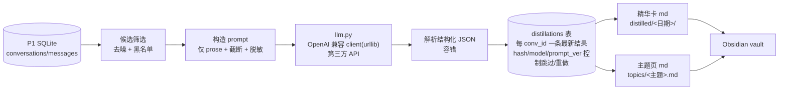

# LLM 精炼层（distill）设计文档

Date: 2026-06-15
Version: v1.3
Status: 已通过 Codex 两轮评审，待实现

> v1.1（自审，G2 经真实数据证实）：候选筛选改结构信号、主题封闭词表、对账清理、`--dry-run`、JSON 剥围栏、成本估算。
>
> v1.3（Codex 二轮复核后）：清理 5 处旧语义残留——架构图缓存描述、错误处理段「不缓存」、目标段「消息数过少」、首跑段「<4 消息/200-230」、`native_id` 来源（从 `id` 去 `source:` 前缀），使全文与 v1.2 决策一致，避免实现按旧段落走偏。
>
> v1.2（Codex 评审后，7 点已并入并经真实库验证）：①明确 distill 的 prose 来源为 `messages.kind='prose'`（实测已存在该列；附带修正 P1 设计文档 schema 漂移）；②缓存语义定为**每会话只存最新**(PK conv_id)，消除复合键歧义；③失败统一**入库**(`status/attempt_count/last_error_at`)，可重试可统计；④候选改**prose 信号**(user/assistant prose 数 + prose 字符数)而非 message_count，实测候选 224；⑤对账清理**仅删带 `generated_by` 标记**的文件，绝不裸清空目录（防误删 Obsidian 手写）；⑥`--dry-run` 不需 API key、模型**输出再脱敏一次**；⑦JSON **字符串感知括号扫描** + 400 自动降级去 `response_format` 重试。

依赖：建于已完成的[沉淀层 P1](2026-06-14-agent-conversation-sediment-design.md) 之上。本层只读 P1 产出的 `conversations`/`messages`，不改采集逻辑。

## 一句话

把沉淀下来的会话用**第三方 LLM**逐个提炼成结构化「精华卡」（总结/要点/决策/待办/主题标签/价值分），自动**去噪**、按**主题**聚合成主题页，写进 Obsidian——即设计文档里推迟的「北极星」第一步。

## 目标（对应用户诉求）

- **按主题分类**：模型给每个会话打主题标签，聚合成「主题页」。
- **去掉没用的**：调用前只按 **prose 信号** 过滤（prose 轮次过少 / prose 字符数过少、Claude 子代理 `agent-*` 会话、黑名单项目）；**不按标题文本、也不按 message_count 过滤**（前者误杀真会话，后者被 tool 噪声污染）；其余低价值由模型自标 `drop` + `value` 分判定。
- **做成可沉淀的形式**：每个有价值会话产出一张结构化 Markdown 精华卡。
- **第三方 API**：不绑厂商，OpenAI 兼容接口，配置式（base_url / key / model）。
- **增量、可断点续、省钱**：按 `content_hash` 缓存，只处理新增/变化会话；`--limit` 试跑。

## 非目标（刻意砍掉）

- 不做审核队列 / 发布工作流 / 置信度门控（再往后的北极星）。
- 不做向量库 / 语义检索（这层产出的结构化数据为将来留口，但本期不建）。
- 不改 P1 采集 / sync / 三层档案。
- **不把 distill 并入每日 launchd 自动任务**——它出网、花钱，必须显式手动触发。

## ⚠️ 隐私（头等约束，本层最大的性质改变）

P1 之前 100% 本地不出网。本层会把会话正文发给第三方 API，对话里含 token、密钥、私密路径、客户信息。处理原则:

1. **只发 prose 正文**，绝不发 `tool`/`tool_result` 消息——工具输出最常 dump 密钥、文件内容、环境变量。
2. **发送前过一道脱敏**：正则抹掉常见密钥/token（`sk-…`、`gh[pousr]_…`、AWS、Bearer）、邮箱、`/Users/<name>` 绝对路径中的用户名等；脱敏只作用于"发出去的副本"，本地档案保留原文。
3. **端点可配**：base_url 可指自建 / 可信代理 / 公司内网，用户自行控制数据流向。
4. **显式 opt-in**：只在用户手动 `agent-archive distill` 时运行；`--yes` 之外首次运行打印一次"将把 N 个会话发往 <base_url>"确认。
5. **可排除项目/会话**：支持 `--exclude-project` 与一张本地黑名单，敏感项目永不外发。

## P1 契约依赖（point 1：prose 来源必须可验证）

"只发 prose"这条隐私防线依赖一个明确契约：**prose 正文 = `messages` 表中 `kind='prose'` 的行**。已对实际库核验（实测列为 `conv_id/seq/role/ts/kind/text`，`kind` 已存在；P1 *设计文档* 的 schema 漏写了 `kind`，属文档漂移，已一并修正 P1 文档）。

- distill 取正文一律 `SELECT role, text FROM messages WHERE conv_id=? AND kind='prose' ORDER BY seq`。
- `kind IN ('tool','thinking','sidechain')` 的行**永不进入 prompt**（实测 tool 35240 / thinking 5479 / sidechain 3318 / prose 12300——tool 占大头，排除后外发面大幅缩小）。
- 本层**不改 P1 messages 表**；若将来 P1 schema 变更，此契约（`kind='prose'`）是唯一耦合点，需同步维护。

## 架构



## 组件边界（新增文件，零三方依赖，仅标准库 + urllib）

### `llm.py` —— 唯一出网点
OpenAI 兼容 Chat Completions 客户端，用 `urllib.request` POST。
- 配置全来自环境变量（与既有 `AGENT_ARCHIVE_ROOT` 同前缀）：`AGENT_ARCHIVE_LLM_BASE_URL`、`AGENT_ARCHIVE_LLM_API_KEY`、`AGENT_ARCHIVE_LLM_MODEL`（缺失即报错并提示如何配）。
- 接口：`complete(system: str, user: str, *, json_mode=True, timeout=60) -> str`。
- 请求 `response_format={"type":"json_object"}`（兼容端点支持时），并在 prompt 里也要求 JSON，双保险。
- **400 自动降级（point 7）**：若端点因不支持 `response_format` 返回 400，**自动去掉该字段重试一次**（仅靠 prompt 约束 JSON）。
- 重试/退避：429 与 5xx 指数退避（最多 N 次）；超时/网络错误抛 `LLMError`。
- **为可测试，client 是可注入的**：`distill` 接收一个 `complete` 可调用对象，测试传 fake，绝不在测试里联网。

### `distill.py` —— 编排
- `select_candidates(conn, ...) -> list[conv]`：**按 prose 信号筛**（point 4，比 message_count 准——后者会把 35k 条 tool 噪声算进去）。每会话统计：
  - `user_prose = COUNT(kind='prose' AND role='user')`
  - `assistant_prose = COUNT(kind='prose' AND role='assistant')`
  - `prose_chars = SUM(LENGTH(text)) WHERE kind='prose'`
  
  **入选条件**：`user_prose >= 1` 且 `assistant_prose >= 1` 且 `prose_chars >= PROSE_MIN_CHARS(默认200)`。
  **再排除**：Claude 子代理会话（`native_id` 以 `agent-` 开头；P1 `conversations` 表无独立 `native_id` 列，从 `id` 去掉 `source:` 前缀得到，即 SQL `substr(id, instr(id,':')+1)`）、黑名单/`--exclude-project`、已缓存（按上节跳过规则）。
  **绝不按标题文本过滤**（v1.1 已证会误杀）。实测该 prose 信号下候选 **224** 个；`prose_chars` 阈值可拦掉"短但只是寒暄"的会话，又不会因 tool 噪声误留。低价值的最终由模型 `drop/value` 兜底。
  `build_prompt` 可顺手丢掉已知系统开场首句以省 token。
- `build_prompt(conv, messages) -> (system, user)`：只取 `kind=='prose'` 的消息，按"role: text"拼接，整体截断到 `MAX_PROMPT_CHARS(默认 12000)`（超长取首尾各半，中间省略），调用脱敏 `redact()`。
- `distill_one(conv, complete) -> Distillation`：调 client → 容错解析 JSON → 输出再脱敏（point 6）→ 据 `drop`/`value` 定 `status='ok'|'dropped'`；解析两次都失败 → `status='error'`、记 `last_error`。
- `run(conn, complete, limit=None, full=False) -> dict`：遍历候选，逐个 distill，**每会话 try/except 隔离**（一个失败不中断、`status='error'` 入库），写 `distillations` 表（含成功/dropped/error 三态），返回 `{ok, dropped, skipped, failed}`。

### `redact.py` —— 脱敏（尽力而为，G4）
`redact(text) -> str`：正则替换 `sk-[A-Za-z0-9]{20,}`、`gh[pousr]_[A-Za-z0-9]{20,}`、`AKIA[0-9A-Z]{16}`、`Bearer\s+\S+`、邮箱、`/Users/<user>/` → 占位符。独立纯函数，单测覆盖。
**双向脱敏（point 6）**：
- **出站**：`build_prompt` 发送前对正文 `redact()`。
- **回程**：模型 `summary/bullets/decisions/todos` 可能复述敏感信息，**渲染卡片前再 `redact()` 一遍**，该会话 `redacted=1`。

> **诚实声明**：正则脱敏是**尽力而为**，挡不住自定义格式 token、或正文里"我的密码是 X"这类自然语言泄露。真正的隐私控制是三层：① 只发 prose、不发工具输出；② 端点可指自建/可信代理；③ 项目黑名单 + `--dry-run` 审计。脱敏只是兜底，不是保证。敏感项目应直接拉黑而非依赖脱敏。

### 模型输出契约（结构化 JSON）
`distill_one` 要求模型返回：
```json
{
  "summary": "一句话总结",
  "bullets": ["要点1","要点2","..."],
  "decisions": ["关键决策（可空）"],
  "todos": ["待办（可空）"],
  "topics": ["主题标签1","主题标签2"],
  "value": 0-5,
  "drop": false
}
```
- 所有文本字段**用中文输出**（用户语言）。
- `drop=true` 或 `value < VALUE_MIN(默认2)` → 标记为低价值，不生成精华卡（但仍缓存，避免重复调用）。
- **`topics` 用封闭受控词表**（G1 防碎片化）：模型只能从固定集合里选 1-3 个，不得自造。默认词表（取自用户真实项目分布，可在常量里调）：
  `电商运营`、`3D打印`、`Agent/AI开发`、`部署运维`、`网页爬虫`、`创意设计`、`知识管理`、`产品规划`、`学习研究`、`工具脚本`、`其他`。
  prompt 显式给出该列表并要求"只能选其中的值"。`其他` 里反复出现的主题，留作后续人工/单独一轮提升为正式大类（本期不做）。受控词表同时消除主题页 slug 撞名问题。

### JSON 解析容错（G5 + point 7）
很多第三方 OpenAI 兼容端点**不支持 `response_format`**，模型可能把 JSON 包在 ```` ```json ```` 围栏里或前面加说明文字。解析必须：① 先剥 Markdown 代码围栏；② **字符串感知的括号扫描**抓取第一个完整 `{…}`——逐字符计大括号深度，但**跳过字符串字面量内的括号与转义**，不能简单"第一个 `{` 到最后一个 `}`"（会被正文里的 `}` 截断）；③ `json.loads`；④ 失败则重试一次（prompt 末尾追加"只输出 JSON，不要任何其他文字"）；⑤ 再失败 → `status='error'` 入库（point 3）。

### `store.py` 增量
新表（不动 P1 既有表）。**缓存语义明确为「每会话只存最新一条」**（PK `conv_id`，无历史；point 2 消除复合键歧义）；**失败也入库**（`status`，point 3）：
```sql
CREATE TABLE IF NOT EXISTS distillations (
  conv_id TEXT PRIMARY KEY,        -- 每会话仅一行（最新结果）
  content_hash TEXT NOT NULL,      -- 与会话当前 hash 比对决定是否重做
  model TEXT NOT NULL,
  prompt_version TEXT NOT NULL,
  status TEXT NOT NULL,            -- 'ok' | 'error' | 'dropped'
  summary TEXT, bullets TEXT, decisions TEXT, todos TEXT,
  topics TEXT,                     -- JSON 数组字符串
  value INTEGER,
  redacted INTEGER NOT NULL DEFAULT 0,   -- 输出是否再脱敏过（point 6）
  attempt_count INTEGER NOT NULL DEFAULT 0,
  last_error TEXT, last_error_at TEXT,
  created_at TEXT NOT NULL, updated_at TEXT NOT NULL,
  FOREIGN KEY (conv_id) REFERENCES conversations(id)
);
```
**跳过/重试规则（point 2+3 统一）**：
- `status='ok'` 且 `content_hash`+`model`+`prompt_version` 全一致 → 跳过。
- `status='dropped'` 且同上一致 → 跳过（已判定低价值，不重复花钱）。
- `status='error'` → **允许重试**（`attempt_count++`），直到成功或超过 `MAX_ATTEMPTS(默认3)`。
- `content_hash`/`model`/`prompt_version` 任一变化 → 重做（覆盖该行）。

新函数：`get_distillation`、`upsert_distillation`（含 status）、`distillations_by_topic`（仅 status='ok'）、`distill_stats`（按 status 计数 + 失败原因 top）。

### `render_distill.py` —— 产物（含对账清理，G3）
- 精华卡 `distilled/<起始日期>/<source>__<slug>__<native_id>.md`：front matter（conv_id/源/主题/价值/链接回 raw 与原始 md）+ 正文（总结/要点/决策/待办）。文件名沿用 P1 的完整 `native_id`，无碰撞。
- 主题页 `topics/<主题slug>.md`：列出该主题下所有会话的一句话总结 + 链接（按时间倒序）。
- **每个生成文件都带所有权标记**：front matter 含 `generated_by: agent-archive-distill`（point 5）。
- **对账重建（仅限自有文件，关键）**：每次渲染从 `distillations` 表重建，但**清理只针对带 `generated_by: agent-archive-distill` 标记的文件**：
  - 扫描 `distilled/` 与 `topics/`，只考虑带该标记的 `.md`；**绝不裸 `rm -rf` 目录**（Obsidian 里可能有用户手写笔记/同名文件）。
  - 表中 `status='ok'` 的会话 → 写/更新其卡片；`status IN ('dropped','error')` 或表中已无的会话 → 删除其（带标记的）旧卡片。
  - 主题页：删掉所有自有标记的旧主题页后按 DB 重写（受控词表，文件名固定，不会误删用户文件）。
  这既避免"内容变了/翻 dropped 后旧 md 残留"（与 P1 的 md 覆盖 bug 同类），又杜绝误删用户手写内容。

### `cli.py` 新子命令
```
agent-archive distill [--limit N] [--full] [--exclude-project X] [--dry-run] [--yes]
                         # 跑精炼；首次/未 --yes 时打印将外发的会话数与目标 base_url 确认
                         # --dry-run：只打印将外发哪些会话 + 脱敏后 prompt 样例，绝不联网（隐私审计）
                         #            **不要求配置 API key/base_url**（只做候选筛选+prompt+脱敏），降低审计门槛 (point 6)
agent-archive topics     # 重建主题索引页
agent-archive distill-stats   # 已精炼/丢弃/失败/各主题计数
```
distill 跑完自动重建主题页（含对账清理）。产物目录可像 md/ 一样软链进 Obsidian。

## 数据流 / 增量 / 错误处理

- 增量：`distillations.content_hash` 与会话当前 hash 比对，相同跳过；`--full` 忽略缓存重做。
- 断点续：每会话成功即写库 commit，中断后重跑只补未完成的。
- 错误隔离：单会话 API/解析失败 → `failed++`、**失败入库 `status='error'`、`attempt_count++`、记 `last_error/last_error_at`**，不中断整轮；未超过 `MAX_ATTEMPTS(默认3)` 时下次运行重新选中重试。
- 限流：429/5xx 指数退避；`--limit` 控制单次量与花费。
- 版本化：`prompt_version` 常量；改 prompt 或换 model 时旧缓存自然失效（key 含 model+prompt_ver 比对）。

## 测试（TDD，绝不联网）

- `redact`：各类密钥/邮箱/路径被抹、正常文本不动；**模型输出回程脱敏**也走同一函数（point 6）。
- `select_candidates`：**prose 信号**（user/assistant prose≥1 且 prose_chars≥阈值）入选；子代理 `agent-*`/黑名单/已缓存(ok/dropped)被排除；`status='error'` 的会被重新选中重试（point 3+4）；`(无标题)` 但有 prose 的真会话被保留（G2 回归）。
- `build_prompt`：**只取 `kind='prose'`**（point 1 契约）、超长截断首尾、已脱敏、丢掉已知系统开场首句。
- JSON 解析：剥 ```` ```json ```` 围栏；**字符串感知括号扫描**——正文 `"...}..."` 里的 `}` 不能误判结束（point 7）；合法/非法分别处理。
- LLM 400 降级：fake client 首次抛 400 → 去 `response_format` 重试成功（point 7）。
- `topics` 受控：模型返回词表外标签时归入"其他"，不进正式主题集。
- `distill_one`：fake 返回合法 JSON → 解析+输出脱敏+`status='ok'`；`drop`/低 value → `status='dropped'`；坏 JSON 两次 → `status='error'` 不抛。
- `run`：fake client，多会话含一个抛错 → 其余成功、`failed` 计数、error 入库且下次可重试、`ok` 幂等。
- `store` distillations：upsert/get/by_topic(仅 ok)/stats(按 status)/跳过与重试规则（point 2+3）。
- `render_distill`：精华卡/主题页结构正确；**对账只删带 `generated_by` 标记的文件**——无标记的用户手写同名文件**不被删**（point 5 回归）；dropped 会话卡片被删。
- 全程用 fake LLM client，零真实 API 调用。

## 首跑预期与成本

- 候选数（按 prose 信号筛选 `user_prose>=1 且 assistant_prose>=1 且 prose_chars>=200`，再排除 `agent-*` 子代理/黑名单，保留了原会被误杀的真会话）：实测 **224** 个。
- **顺序执行**（v1 不并发，便于错误隔离与限流）：每会话一次调用 ≈ 3-10 秒 → 首跑约 **15-35 分钟**。并发推迟到将来。
- token 量：每会话只发 prose 且截断到 `MAX_PROMPT_CHARS`(默认 12000 字符 ≈ 4k token)，输出几百 token → 单会话约 ~5k token；全量 ~1-1.2M token。按主流第三方 model（如 DeepSeek/gpt-4o-mini 级）量级，全量花费很低。
- 建议先 `distill --limit 10` 试跑看精华卡质量与主题标签是否合理，再全量；`--dry-run` 先审计外发内容。

## 实现范围（最小闭环）

1. `llm.py`（OpenAI 兼容 client，可注入）+ `redact.py`。
2. `distillations` 表 + store 函数。
3. `distill.py`（候选筛选 / prompt / distill_one / run，错误隔离 + 缓存）。
4. `render_distill.py`（精华卡 + 主题页）。
5. CLI `distill` / `topics` / `distill-stats`（含外发确认）。
6. 软链 `distilled/`、`topics/` 进 Obsidian + README 更新（含隐私说明与配置示例）。

## 风险与对策

| 风险 | 对策 |
|------|------|
| 🔴 候选筛选误杀真会话(G2/p4) | **按 prose 信号筛**（user/assistant prose≥1 + prose字符阈值），不按标题/不按 message_count；噪声交模型 drop |
| 🔴 主题标签碎片化(G1) | **封闭受控词表**，模型只能选不能造；slug 撞名一并消除 |
| prose 来源不可验证(p1) | 契约钉死 `messages.kind='prose'`（实测列存在）；本层不改 P1 表 |
| 对话含密钥/隐私外发 | 只发 prose、**出站+回程双向 `redact`**、端点可配、显式 opt-in、黑名单、`--dry-run`(免 key) 审计、不进每日自动任务 |
| 误删 Obsidian 手写(p5) | 清理**仅限带 `generated_by` 标记**的文件，绝不裸清空目录 |
| 缓存/失败语义混乱(p2/p3) | 每会话只存最新(PK conv_id)；失败入库 `status='error'`+`attempt_count`，可重试可统计 |
| 陈旧产物残留(G3) | 渲染对账：主题页重建、dropped/失效会话卡片删除（仅自有文件） |
| 模型返回非法 JSON(G5/p7) | 剥围栏 + **字符串感知括号扫描** + 400 降级去 response_format + 重试 + `status='error'` 入库 |
| 第三方 API 不稳/限流 | 每会话错误隔离 + 指数退避 + 断点续 + `--limit` |
| 超长会话超 token | 只 prose + 截断首尾各半 |
| 首跑花费/耗时 | 顺序 ~15-35 分钟；默认提示确认 + `--limit` 试跑 + 增量缓存 |

## 待你拍板的实现细节

- 第三方 model 选谁（决定 base_url/model 默认值与提示语；如 DeepSeek 中文性价比高、或 OpenAI gpt-4o-mini）。
- 精华卡/主题页产物目录是否也软链进 Obsidian（默认是）。
- `MIN_MSGS`(默认4) / `VALUE_MIN`(默认2) / `MAX_PROMPT_CHARS`(默认12000) 阈值。
