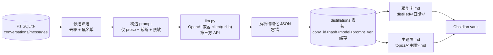

# LLM 精炼层（distill）设计文档

Date: 2026-06-15
Version: v1.0
Status: 待用户评审

依赖：建于已完成的[沉淀层 P1](2026-06-14-agent-conversation-sediment-design.md) 之上。本层只读 P1 产出的 `conversations`/`messages`，不改采集逻辑。

## 一句话

把沉淀下来的会话用**第三方 LLM**逐个提炼成结构化「精华卡」（总结/要点/决策/待办/主题标签/价值分），自动**去噪**、按**主题**聚合成主题页，写进 Obsidian——即设计文档里推迟的「北极星」第一步。

## 目标（对应用户诉求）

- **按主题分类**：模型给每个会话打主题标签，聚合成「主题页」。
- **去掉没用的**：噪声会话（无标题子代理 / 系统注入开场 / 过短）在调用前就过滤；模型还可对低价值会话自标 `drop`。
- **做成可沉淀的形式**：每个有价值会话产出一张结构化 Markdown 精华卡。
- **第三方 API**：不绑厂商，OpenAI 兼容接口，配置式（base_url / key / model）。
- **增量、可断点续、省钱**：按 `content_hash` 缓存，只处理新增/变化会话；`--limit` 试跑。

## 非目标（刻意砍掉）

- 不做审核队列 / 发布工作流 / 置信度门控（再往后的北极星）。
- 不做向量库 / 语义检索（这层产出的结构化数据为将来留口，但本期不建）。
- 不改 P1 采集 / sync / 三层档案。
- **不把 distill 并入每日 launchd 自动任务**——它出网、花钱，必须显式手动触发。

## ⚠️ 隐私（头等约束，本层最大的性质改变）

P1 之前 100% 本地不出网。本层会把会话正文发给第三方 API，对话里含 token、密钥、私密路径、客户信息。处理原则:

1. **只发 prose 正文**，绝不发 `tool`/`tool_result` 消息——工具输出最常 dump 密钥、文件内容、环境变量。
2. **发送前过一道脱敏**：正则抹掉常见密钥/token（`sk-…`、`gh[pousr]_…`、AWS、Bearer）、邮箱、`/Users/<name>` 绝对路径中的用户名等；脱敏只作用于"发出去的副本"，本地档案保留原文。
3. **端点可配**：base_url 可指自建 / 可信代理 / 公司内网，用户自行控制数据流向。
4. **显式 opt-in**：只在用户手动 `agent-archive distill` 时运行；`--yes` 之外首次运行打印一次"将把 N 个会话发往 <base_url>"确认。
5. **可排除项目/会话**：支持 `--exclude-project` 与一张本地黑名单，敏感项目永不外发。

## 架构



## 组件边界（新增文件，零三方依赖，仅标准库 + urllib）

### `llm.py` —— 唯一出网点
OpenAI 兼容 Chat Completions 客户端，用 `urllib.request` POST。
- 配置全来自环境变量（与既有 `AGENT_ARCHIVE_ROOT` 同前缀）：`AGENT_ARCHIVE_LLM_BASE_URL`、`AGENT_ARCHIVE_LLM_API_KEY`、`AGENT_ARCHIVE_LLM_MODEL`（缺失即报错并提示如何配）。
- 接口：`complete(system: str, user: str, *, json_mode=True, timeout=60) -> str`。
- 请求 `response_format={"type":"json_object"}`（兼容端点支持时），并在 prompt 里也要求 JSON，双保险。
- 重试/退避：429 与 5xx 指数退避（最多 N 次）；超时/网络错误抛 `LLMError`。
- **为可测试，client 是可注入的**：`distill` 接收一个 `complete` 可调用对象，测试传 fake，绝不在测试里联网。

### `distill.py` —— 编排
- `select_candidates(conn, ...) -> list[conv]`：跳过噪声（`title=='(无标题)'`、`title LIKE 'You are running as%'`/`'The following is the Codex%'`/`'<local-command-caveat%'`、`message_count <= MIN_MSGS(默认4)`）、跳过黑名单/排除项目、跳过已缓存（同 `content_hash`+model+prompt_ver）。
- `build_prompt(conv, messages) -> (system, user)`：只取 `kind=='prose'` 的消息，按"role: text"拼接，整体截断到 `MAX_PROMPT_CHARS(默认 12000)`（超长取首尾各半，中间省略），调用脱敏 `redact()`。
- `distill_one(conv, complete) -> Distillation`：调 client → 解析 JSON（失败重试一次、再失败记 `error` 不缓存）。
- `run(conn, complete, limit=None, full=False) -> dict`：遍历候选，逐个 distill，**每会话 try/except 隔离**（一个失败不中断），写 `distillations` 表，返回 `{processed, skipped, dropped, failed}`。

### `redact.py` —— 脱敏
`redact(text) -> str`：正则替换 `sk-[A-Za-z0-9]{20,}`、`gh[pousr]_[A-Za-z0-9]{20,}`、`AKIA[0-9A-Z]{16}`、`Bearer\s+\S+`、邮箱、`/Users/<user>/` → 占位符。独立纯函数，单测覆盖。

### 模型输出契约（结构化 JSON）
`distill_one` 要求模型返回：
```json
{
  "summary": "一句话总结",
  "bullets": ["要点1","要点2","..."],
  "decisions": ["关键决策（可空）"],
  "todos": ["待办（可空）"],
  "topics": ["主题标签1","主题标签2"],
  "value": 0-5,
  "drop": false
}
```
- `drop=true` 或 `value < VALUE_MIN(默认2)` → 标记为低价值，不生成精华卡（但仍缓存，避免重复调用）。
- `topics` 用受控引导（prompt 给出建议大类：编程/产品/电商/3D打印/部署运维/创意设计/学习研究/其他），允许新标签但鼓励复用。

### `store.py` 增量
新表（不动 P1 既有表）：
```sql
CREATE TABLE IF NOT EXISTS distillations (
  conv_id TEXT PRIMARY KEY,
  content_hash TEXT NOT NULL,     -- 命中即跳过；变化则重做
  model TEXT NOT NULL,
  prompt_version TEXT NOT NULL,
  summary TEXT, bullets TEXT, decisions TEXT, todos TEXT,
  topics TEXT,                    -- JSON 数组字符串
  value INTEGER, dropped INTEGER NOT NULL DEFAULT 0,
  error TEXT,
  created_at TEXT NOT NULL,
  FOREIGN KEY (conv_id) REFERENCES conversations(id)
);
```
新函数：`get_distillation`、`upsert_distillation`、`distillations_by_topic`、`distill_stats`。

### `render_distill.py` —— 产物
- 精华卡 `distilled/<起始日期>/<source>__<slug>__<native_id>.md`：front matter（conv_id/源/主题/价值/链接回 raw 与原始 md）+ 正文（总结/要点/决策/待办）。
- 主题页 `topics/<主题slug>.md`：列出该主题下所有会话的一句话总结 + 链接（按时间倒序）。

### `cli.py` 新子命令
```
agent-archive distill [--limit N] [--full] [--exclude-project X] [--yes]
                         # 跑精炼；首次/未 --yes 时打印将外发的会话数与目标 base_url 确认
agent-archive topics     # 重建主题索引页
agent-archive distill-stats   # 已精炼/丢弃/失败/各主题计数
```
distill 跑完自动重建主题页。产物目录可像 md/ 一样软链进 Obsidian。

## 数据流 / 增量 / 错误处理

- 增量：`distillations.content_hash` 与会话当前 hash 比对，相同跳过；`--full` 忽略缓存重做。
- 断点续：每会话成功即写库 commit，中断后重跑只补未完成的。
- 错误隔离：单会话 API/解析失败 → `failed++`、记 `error`、不缓存（下次重试），不中断整轮。
- 限流：429/5xx 指数退避；`--limit` 控制单次量与花费。
- 版本化：`prompt_version` 常量；改 prompt 或换 model 时旧缓存自然失效（key 含 model+prompt_ver 比对）。

## 测试（TDD，绝不联网）

- `redact`：各类密钥/邮箱/路径被抹、正常文本不动。
- `select_candidates`：噪声/黑名单/已缓存被正确排除。
- `build_prompt`：只含 prose、超长截断首尾、已脱敏。
- `distill_one`：注入 fake `complete` 返回合法 JSON → 正确解析；返回坏 JSON → 重试后记 error 不抛；`drop`/低 value → 标记。
- `run`：fake client，多会话含一个抛错 → 其余成功、failed 计数、缓存正确、幂等。
- `store` distillations：upsert/get/by_topic/幂等。
- `render_distill`：精华卡与主题页结构正确。
- 全程用 fake LLM client，零真实 API 调用。

## 首跑预期与成本

- 候选约 **160** 个会话（已排除 ~172 噪声）。
- 建议先 `distill --limit 10` 试跑看精华卡质量与主题标签是否合理，再全量。
- 花费取决于你选的第三方 model 与定价；只发 prose + 截断到 ~12k 字符控制单次 token。

## 实现范围（最小闭环）

1. `llm.py`（OpenAI 兼容 client，可注入）+ `redact.py`。
2. `distillations` 表 + store 函数。
3. `distill.py`（候选筛选 / prompt / distill_one / run，错误隔离 + 缓存）。
4. `render_distill.py`（精华卡 + 主题页）。
5. CLI `distill` / `topics` / `distill-stats`（含外发确认）。
6. 软链 `distilled/`、`topics/` 进 Obsidian + README 更新（含隐私说明与配置示例）。

## 风险与对策

| 风险 | 对策 |
|------|------|
| 对话含密钥/隐私外发 | 只发 prose、发送前 `redact`、端点可配、显式 opt-in、项目黑名单、不进每日自动任务 |
| 第三方 API 不稳/限流 | 每会话错误隔离 + 指数退避 + 断点续 + `--limit` |
| 模型返回非法 JSON | 双重要求 JSON + 容错解析 + 重试一次 + 记 error 不缓存 |
| 超长会话超 token | 只 prose + 截断首尾各半 |
| 主题标签发散 | prompt 给受控大类引导，鼓励复用，`topics` 命令可后续归并 |
| 首跑花费/耗时 | 默认提示确认 + `--limit` 试跑 + 增量缓存 |

## 待你拍板的实现细节

- 第三方 model 选谁（决定 base_url/model 默认值与提示语；如 DeepSeek 中文性价比高、或 OpenAI gpt-4o-mini）。
- 精华卡/主题页产物目录是否也软链进 Obsidian（默认是）。
- `MIN_MSGS`(默认4) / `VALUE_MIN`(默认2) / `MAX_PROMPT_CHARS`(默认12000) 阈值。
